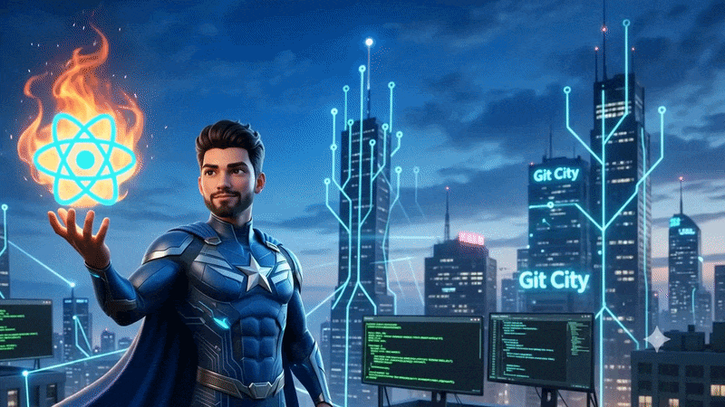

<!--
  Modern, recruiter-friendly GitHub Profile README
  - Personalized for Tholeti Durgeswara Rao
  - Ensure Assests/GIF.gif exists at path: Assests/GIF.gif (relative)
-->

<!-- HERO -->
<h1 align="center" style="font-size:48px; margin-bottom:0.2rem;">Tholeti Durgeswara Rao</h1>

  <strong>Building modern web applications with React, Java & MERN Stack</strong> — Full Stack Developer (or CSE Student) • Python & Full-stack • AI & Systems Design

  <!-- Large clickable social badges -->
  
  
  
  
  

---

<!-- ANIMATED MEDIA -->

  
   
  <em style="color:#6b7280; font-size:13px;">Click to view full-size animation (relative path)</em>

---

<!-- ABOUT / CURRENTLY -->
## About / Currently
**Role:** Full Stack Developer (or CSE Student) — building production-grade systems, APIs and AI-driven features.  
**Tech focus:** Python, Django, FastAPI, React, AWS, Docker, PostgreSQL, MongoDB, Redis, LLMs, Prompt Engineering, Vector DBs, System Design.

What I'm doing right now
- Leading backend and architecture for scalable web services (Django + FastAPI).
- Building AI-first features: LLM integration, prompt engineering and vector search.
- Improving system observability, CI/CD, and cost-optimized cloud infra on AWS.

Learning goals
- Production-grade LLM orchestration (RAG, embeddings, retrieval pipelines).
- Advanced system design patterns: event-driven, CQRS, multi-tenant strategies.
- Deepening knowledge of scalable vector DBs and MLOps.

Content & presence
- I publish technical walkthroughs, architecture notes, and prompt/playground demos on my portfolio and LinkedIn.

Ask me about
- Backend APIs, design & performance
- Building LLM-powered features and prompt engineering
- Cloud architecture (AWS) and containerized deployments
- Postgres & MongoDB schema design and indexing strategies
- System design interviews & hiring preparation

---

<!-- SKILLS SHOWCASE -->
## Skills
A curated, recruiter-friendly summary of my technical skills.

### Backend

### Frontend

### Cloud & DevOps

### Databases

### AI / ML

### Tools & Workflow

Notes:
- Badges are powered by skillicons.dev and shields.io for crisp, modern visuals.
- If you want a variant with devicons or more badges per category, I can add that.

---

<!-- GITHUB ANALYTICS -->
## GitHub Analytics

  <!-- Stats card -->
  
  <!-- Top languages -->
  

  <!-- Streaks & trophies -->
  
  

> Tip: To enable dynamic stats, the README already references your GitHub username (ESWAR8357). If you prefer a consistent theme (e.g., "github_dark" or "radical"), I can tailor the cards.

---

<!-- CONTACT -->
## Let's connect
- Portfolio: https://tholeti-eswar.vercel.app  
- Email: toletidurgeswararao@gmail.com  
- LinkedIn: https://linkedin.com/in/tholeti-eswar57  
- Open to: full-time roles, contract, collaboration on AI/ML and system design projects.

---

<!-- FOOTER -->

  Made with ❤️ • Tholeti Durgeswara Rao • Built for clarity, hireability, and product-readiness.

